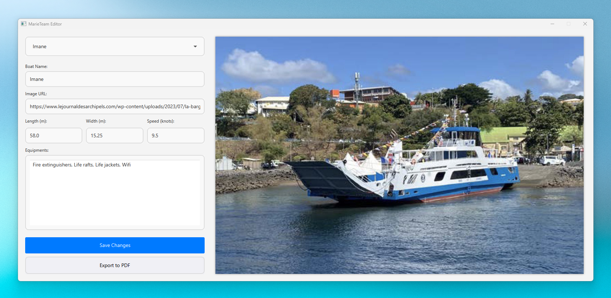

# MarieTeam Editor

MarieTeam Projects is a series of three distinct school projects, each focused on building a different type of
application: a web application, a desktop application, and a mobile app.

The MarieTeam Editor is a desktop application that allows users to edit, and export boats.
This project is built using JavaFX and Java Database Connectivity (JDBC) to connect to a PostgreSQL database. 

> The data used in this project are the data from the [MarieTeam Web](https://github.com/MrInspection/marieteam-web) project. Check out the schema.prisma file of MarieTeam WEb to create the tables.

### How to run this project?
To run this project on your local environment, follow the following steps :

- Clone the repository to your local machine or download the source code.
- Run the [docker-compose.yml](docker-compose.yaml) file to start the PostgreSQL database.
- Configure the database connection in the `.properties` file.
- Execute the `EditorApplication.java` file to start the application.
- Start editing and exporting boats to PDF Files.